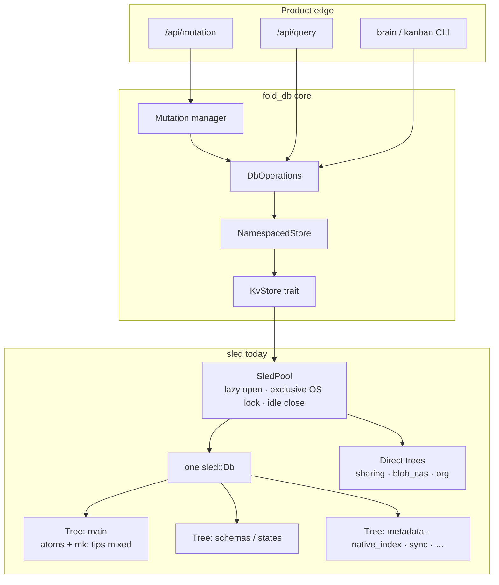
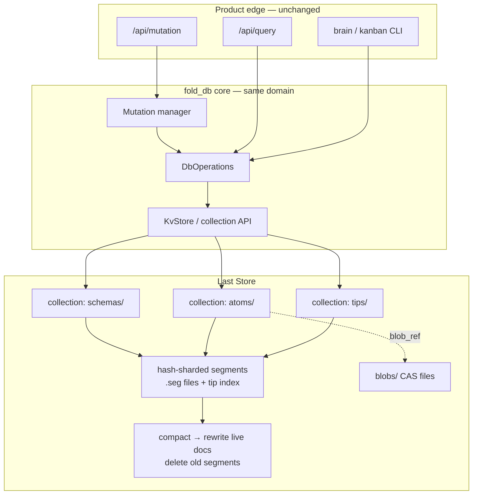
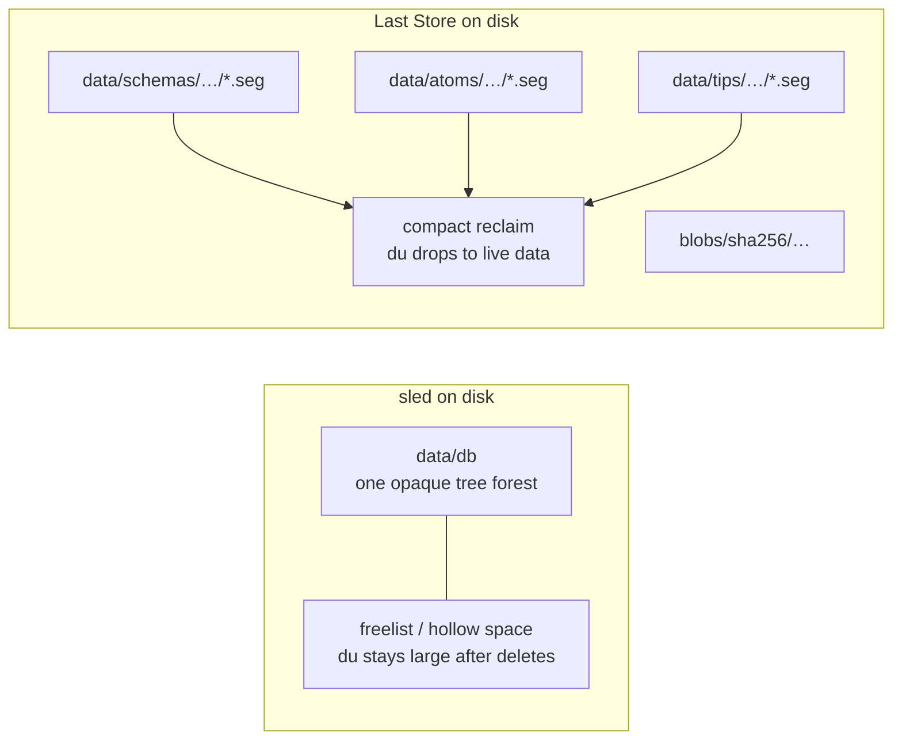
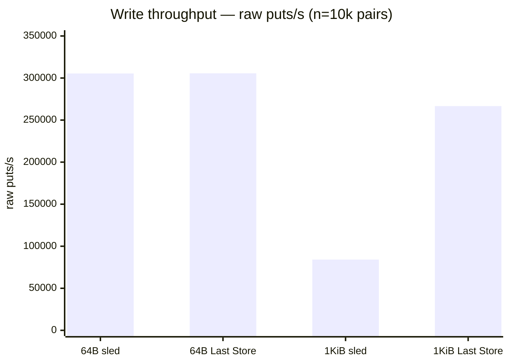
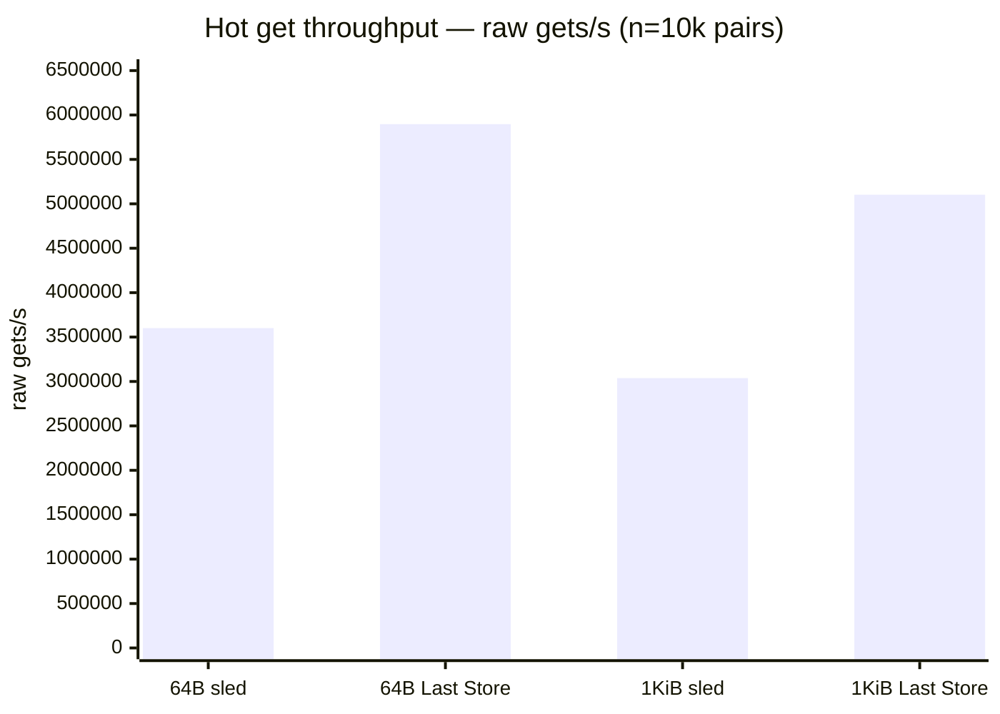
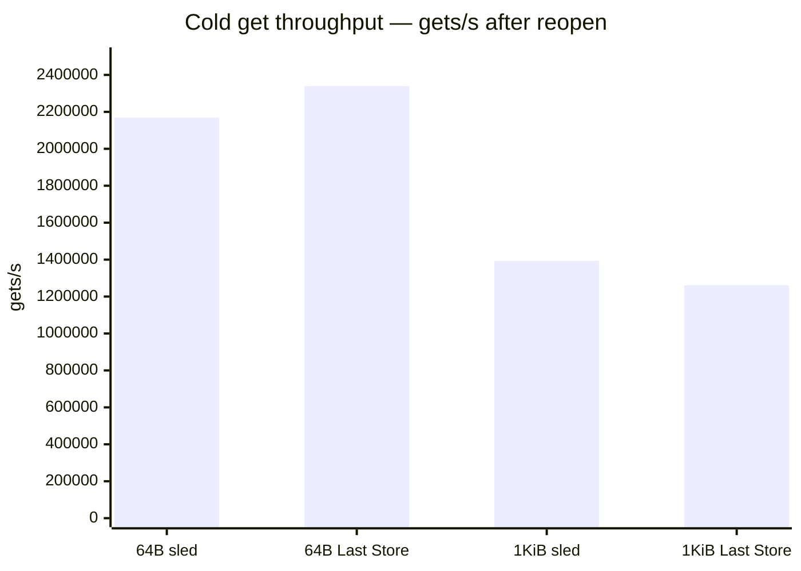
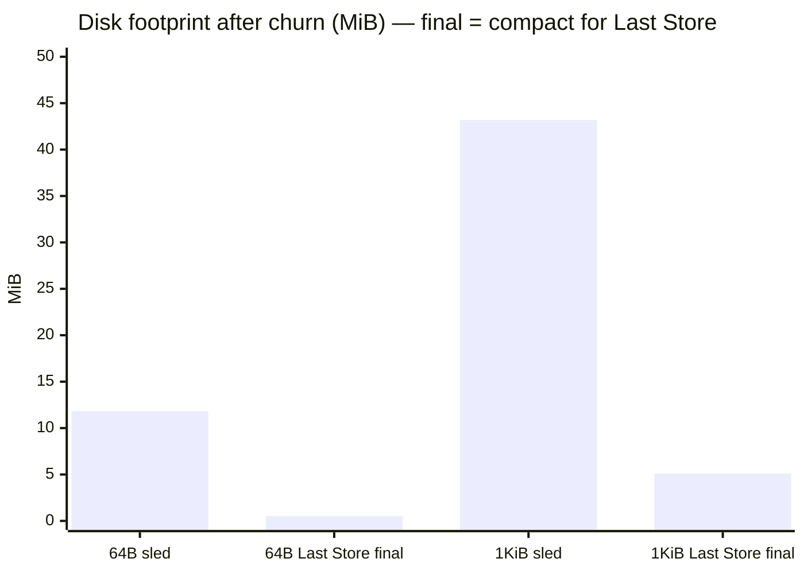
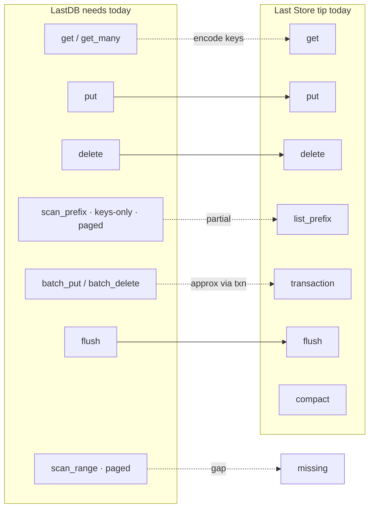
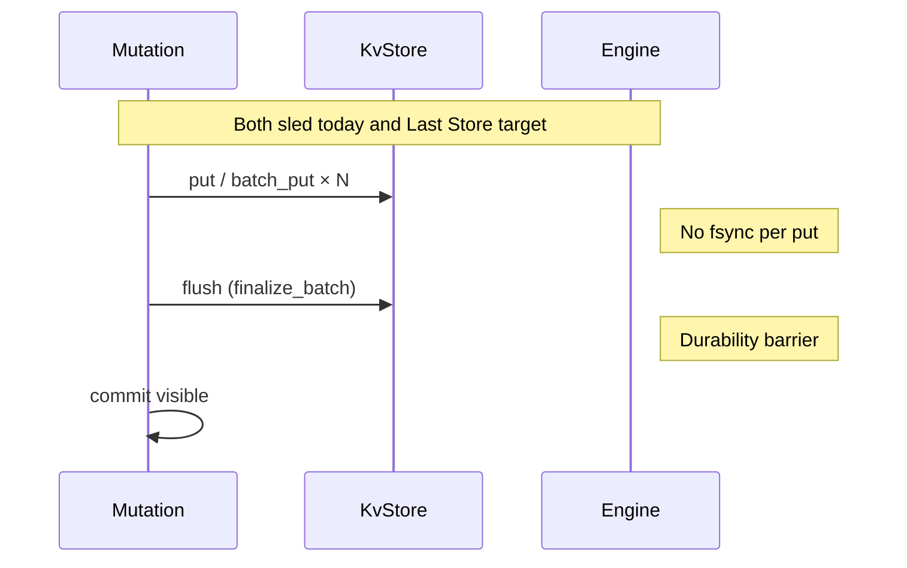
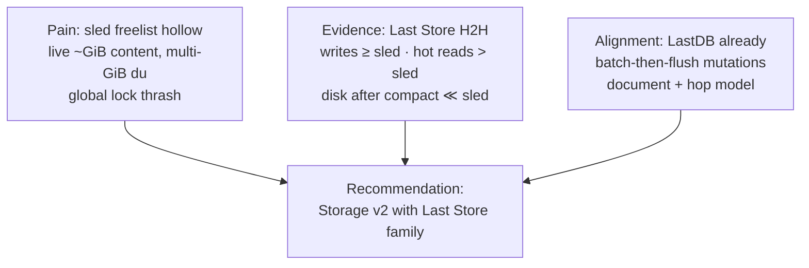

# Storage v2 Decision Brief — **Last Store** vs sled

> Engine product name: **Last Store**. Crate: [`laststore`](lastdb:///laststore).

| Field | Value |
|-------|--------|
| Status | **Recommendation: proceed** (2026-07-17) |
| Product owner | Tom |
| Engine product name | **Last Store** |
| Crate / remote | `laststore` · `lastdb:///laststore` |
| Program | **Storage v2** — three document collections + CAS blobs |
| North Star | `north-star-lastdb-no-sled-document-store` |
| Product design | [`storage-v2-three-collection-document-store.md`](./storage-v2-three-collection-document-store.md) |
| Evidence repo | `lastdb:///autoresearch-docstore` · branch `autoresearch/jul17-lastdb` |
| Head-to-head harness | `bench_vs_sled` · results `results-vs-sled-64.txt`, `results-vs-sled-1024.txt` |
| Brain run log | `reference autoresearch-docstore-run-log` |

**How to use this doc:** point anyone at this file when the question is *“why leave sled / why Storage v2?”* The long product shape lives in the design doc; **this** is the decision brief with evidence.

---

## 1. Recommendation (one screen)

### Proceed with Storage v2, with Last Store as the candidate engine family

**Yes — continue.** Last Store is not a speculative rewrite: under a **true same-workload** comparison with sled (identical N, value size, atom+tip pairs, flush points, counters), it is **competitive or better** on the metrics that match how LastDB actually uses sled today, and **dramatically better** on the metric that motivated the program (disk reclaim).

| Question | Answer |
|----------|--------|
| Is the engine idea credible vs sled? | **Yes** — write ≈ sled @ 64 B, **~3× sled** @ 1 KiB; hot gets **~1.6×**; compact disk **~8–22× smaller** |
| Does it match LastDB’s real durability model? | **Yes** — production already does “batch puts, flush at mutation commit,” not fsync-every-put |
| Is it drop-in for **Mini** tomorrow? | **No** — Mini still needs adapter work (efficient id walks Mini uses today, many namespaces, process lock story, mapping off sled `main`). That is **Mini packaging**, not “LastDB product incomplete.” |
| Why go forward anyway? | The **hard part** (engine competitive + real reclaim) is proven enough to justify product packaging; sled’s freelist hollow and global lock pain will not fix themselves |

**Abstraction North Star:** *Last Store is a multi-collection document store. LastDB is a convention of collections, ids, and documents on top of it.*  
(Brain: `north-star-laststore-is-document-store-last-db-is-conventions`. Full write-up: `lastdb-nano/docs/storage-v2.md` § Abstraction North Star.)

**Decision frame:** Storage v2 is a **local storage cutover** (documents + CAS + reclaim), not a rewrite of brain/kanban APIs. Last Store is the **engine shape** under that cutover. Keep sled until a CoW/GREEN bar on real data says otherwise.

---

## 2. Naming

| Name | What it is |
|------|------------|
| **Storage v2** | Product program: schemas + atoms + tips + CAS blobs; leave sled as the primary local engine |
| **Last Store** | Engine family: multi-collection **segment files**, group-commit, in-memory tip index, explicit **compact** |
| **sled** | Today’s embedded engine under `SledPool` / `KvStore` (trees ≈ namespaces) |

Say: *“Storage v2 replaces sled with Last Store under the same document product model.”*

---

## 3. Architecture — side by side

### 3.1 How LastDB uses sled today



**Durability contract (production code, not theory):**  
`put` / `batch_put` deliberately **do not** `flush` every call. Durability comes from sled’s background flusher (~500 ms) plus an explicit **`flush()` at mutation `finalize_batch`**. That is the same *family* as Last Store group-commit.

### 3.2 Storage v2 + Last Store (target shape)



### 3.3 Physical layout contrast



---

## 4. Head-to-head evidence (true same harness)

**Harness:** `bench_vs_sled` in `autoresearch-docstore`  
**Rules:** same N, value size, atom+tip pair workload, flush after write and after churn, reopen for cold get.  
**Counters:** *logical op* = one atom+tip pair; *raw put/get* = each call.

Machine: Tom’s Mac · tip engine ~`1a82a5e` lineage · sled `0.34` HighThroughput · `flush_every_ms = None` · explicit `flush()` for both.

### 4.1 Write throughput (raw puts/s)

Higher is better.



**ASCII (fallback if chart renderer skips xychart):**

```text
64B   sled      ████████████████████████████████  ~306k put/s
64B   Last Store  ████████████████████████████████  ~306k put/s   (~1.00×)
1KiB  sled      █████████                         ~84k put/s
1KiB  Last Store  ████████████████████████████      ~267k put/s   (~3.17×)
```

### 4.2 Hot read throughput (raw gets/s)

Higher is better. Both hold values in-process after the write phase (Last Store value cache; sled page cache / tree).



```text
64B   sled      ████████████████████              ~3.6M get/s
64B   Last Store  ████████████████████████████████  ~5.9M get/s   (~1.64×)
1KiB  sled      █████████████████                 ~3.0M get/s
1KiB  Last Store  ████████████████████████████      ~5.1M get/s   (~1.68×)
```

### 4.3 Cold get throughput (after reopen)

Higher is better. Closest “not already in the value cache” read path.



```text
64B   sled      ████████████████████████████      ~2.17M get/s
64B   Last Store  ██████████████████████████████    ~2.34M get/s  (~1.08×)
1KiB  sled      ████████████████████              ~1.39M get/s
1KiB  Last Store  ██████████████████                ~1.26M get/s  (~0.90×)
```

### 4.4 Disk after churn / compact

Lower is better. **This is the original product pain.**



```text
64B   sled after churn     ████████████████████████  11.8 MiB
64B   Last Store after compact █                         0.52 MiB   (~22× smaller)
1KiB  sled after churn     ████████████████████████████████████████  43.2 MiB
1KiB  Last Store after compact █████                      5.1 MiB   (~8.5× smaller)
```

### 4.5 Scorecard snapshot

| Dimension | Winner | Notes |
|-----------|--------|--------|
| Writes @ 64 B | **Tie** | Same flush-at-end pair workload |
| Writes @ 1 KiB | **Last Store** (~3×) | Larger values favor sequential segment append |
| Hot gets | **Last Store** (~1.6×) | Value cache |
| Cold gets | **Roughly even** | Last Store slightly ahead @ 64 B; slightly behind @ 1 KiB |
| Disk reclaim | **Last Store (blowout)** | Real compact vs freelist hollow |
| Explainable `du` | **Last Store** | Per-collection / per-shard paths |
| Mature ecosystem | **sled** | Years of production call sites in fold_db |
| Feature surface today | **sled** | Range/paged scans, many trees, pool lock |

---

## 5. API surfaces — what LastDB calls vs what Last Store offers

### 5.1 Production `KvStore` (sled) vs Last Store today



| Capability | sled / KvStore today | Last Store tip | Verdict |
|------------|----------------------|--------------|---------|
| Point get/put/delete | ✅ | ✅ | Map |
| Multi-doc batch + flush at commit | ✅ `batch` + `finalize_batch` flush | ✅ `transaction` / group-commit + `flush` | Map — **aligned durability model** |
| Prefix scan | ✅ ordered, paged, keys-only | ⚠️ `list_prefix` (full values, no page) | **Gap** — must build for query/outbox |
| Range scan | ✅ | ❌ | **Gap** |
| Many namespaces/trees | ✅ | ⚠️ multi-collection API; not full prod set | **Gap** (product, not physics) |
| Real compact / reclaim | ❌ hollow freelist | ✅ | **Last Store win** |
| Encrypt at rest | partial / path-dependent | ❌ on tip (AES path exists in nano spike) | Required for cutover bar |
| Multi-process exclusive pool | ✅ SledPool | ❌ | Redesign or single-writer daemon rule |
| CAS large blobs | tree or files (messy) | design: files under `blobs/` | Storage v2 product shape |

### 5.2 Where the sled win would have to come from (and usually doesn’t)

```mermaid
quadrantChart
    title Workload fit — where each engine shines
    x-axis "Batch flush · sequential" --> "Per-key fsync · high contention"
    y-axis "Space reclaim matters" --> "Only peak micro-ops matter"
    quadrant-1 "Neither default"
    quadrant-2 "Last Store home"
    quadrant-3 "sled default today"
    quadrant-4 "sled batch microbench"
    LastDB mutations: "0.35, 0.75"
    Autoresearch H2H: "0.30, 0.70"
    Per-put fsync toy: "0.85, 0.40"
    Hollow disk pain: "0.40, 0.90"
```

LastDB’s **mutation path** sits in Last Store’s home quadrant: many writes, one durability barrier, space after deletes matters.

---

## 6. Setup & operational model

| Topic | sled (today) | Last Store (target) |
|-------|----------------|-------------------|
| Home layout | Opaque `data/db` | `schemas/`, `atoms/`, `tips/`, `blobs/` — **explainable** |
| Locking | Global Db lock (pool) | Design: **per-shard** locks; tip prototype: single shard |
| Crash window | ~flush interval / commit flush | Group-commit dirty window until `flush` |
| Reclaim | Soft (freelist) — **du lies** | Hard compact — **du tells truth** |
| Migration | n/a | Offline export → CoW proof → cutover (standing preference) |
| Agent / CLI sharing | Idle release unlocks path | Needs explicit multi-process story |



---

## 7. Limitations of the evidence (honesty box)

1. **Engine microbench ≠ full Mini** — not yet replaying Tom’s real `~/.lastdb` CoW workload end-to-end on Last Store.  
2. **Tip is single-shard** — great for sequential H2H; Storage v2 design still wants **hash shards** for concurrent writers and narrower locks. Re-introduce shards with measured regression budgets.  
3. **Molecule / tip→atom product path** is still expensive when every logical record does multi-doc work + flush; engine H2H does not erase that. Optimize *above* Last Store too.  
4. **Feature gaps** (range/paged scans, encrypt, SledPool-equivalent, all side trees) are real engineering, not paper cuts.  
5. **One machine, release builds** — ratios are stable enough for a go decision; re-run H2H in CI on the research repo.

None of these reverse the recommendation; they **scope** the next milestones.

---

## 8. Why go forward — the argument in three beats



1. **Pain is real and structural** — freelist compact does not return space the way product expects; `du` on an opaque Db cannot explain “why big?”  
2. **Evidence is no longer hand-wavy** — same harness, same counters, Last Store wins or ties the load shapes we care about and crushes disk reclaim.  
3. **Architecture already points here** — three collections + CAS is locked in the product design; Last Store is that design’s natural engine, not a detour.

**Opportunity cost of stopping:** stay on sled, keep paying hollow disk + global lock, and keep bolting document semantics onto trees forever.

**Opportunity cost of continuing:** engineering to close API/ops gaps and a careful CoW migration — **bounded**, with a GREEN bar before primary cutover.

---

## 9. Go-forward plan (so “yes” is actionable)

| Phase | Outcome | Stop / go gate |
|-------|---------|----------------|
| **A — Engine harden** | Multi-shard optional; range/prefix paged; binary keys; encrypt-at-rest codec | H2H still ≥ sled on write/hot; disk reclaim preserved |
| **B — KvStore adapter** | Implement production `KvStore` + enough namespaces for mutation/query smoke | One mutation + one query path green on Last Store |
| **C — CoW real data** | Offline export or copy of Mini data → Last Store; correctness + size + smoke | GREEN bar on **copy**, never live first |
| **D — Side stores** | native_index, sync outbox, sharing, blobs CAS on collections/files | No remaining “must open sled tree” on critical path |
| **E — Cutover** | Primary Mini on Last Store; sled retired or standby | Tom clearance + rollback plan |

Standing guardrails (do not undo):

- Never thrash live `~/.lastdb` as the first place a new engine fails.  
- Prefer **`lastdb-safe-upgrade` / CoW** patterns for binary + data moves.  
- Product APIs stay document-shaped; no “SQL is the product.”

---

## 10. What to say in a standup

> We’re proceeding with **Storage v2**. The engine exportable engine is **Last Store** (`laststore`). Under a true head-to-head with sled, Last Store matches writes at 64 B, is ~3× faster at 1 KiB, ~1.6× faster on hot gets, and ~8–22× smaller on disk after compact. That matches how LastDB already writes (batch then flush) and fixes the freelist hollow pain. It’s not a drop-in yet — we still need scans, encrypt, multi-shard, and a CoW migration — but the engine bet is validated enough to build the product packaging.

---

## 11. References

| Artifact | Location |
|----------|----------|
| Product design | `fold/docs/designs/storage-v2-three-collection-document-store.md` |
| This decision brief | `fold/docs/designs/storage-v2-decision-brief-segstore-vs-sled.md` |
| Research loop | `~/code/edgevector/autoresearch-docstore` · `lastdb:///autoresearch-docstore` |
| H2H JSON | `results-vs-sled-64.txt`, `results-vs-sled-1024.txt` |
| Iteration log | brain `autoresearch-docstore-run-log` |
| North Star | `north-star-lastdb-no-sled-document-store` |
| Spike lineage | `fold/spikes/docstore_vs_sled/` · Nano / lastdb-nano extraction |

---

*Document generated 2026-07-17 from measured H2H + fold_db sled usage review. Re-run `bench_vs_sled` after material engine changes and paste new bars into §4.*
